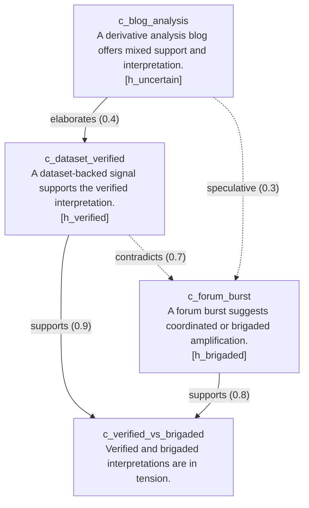

# Generated Claim Graph

- **source**: latest_report
- **run_id**: run-20260311-195453
- **timestamp_utc**: 20260311-195453
- **graph_variant**: baseline

## Summary

- **claim_count**: 4
- **edge_count**: 5
- **relation_counts**: {'supports': 2, 'contradicts': 1, 'elaborates': 1, 'speculative': 1}
- **contradiction_density**: 0.2

## Support by Hypothesis

- **h_brigaded**: -0.7000
- **h_uncertain**: 0.0000
- **h_verified**: 0.0000
